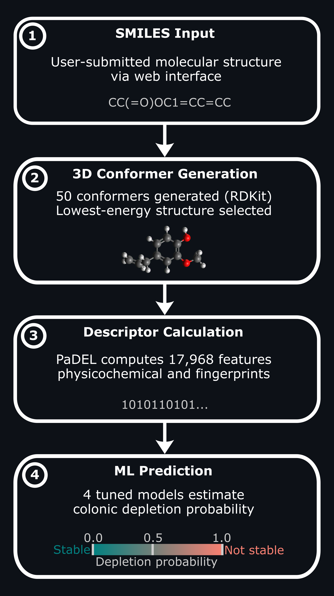

# BiotaPredictor

**BiotaPredictor** is a containerised machine-learning platform for predicting **gut microbial drug depletion** from molecular structure.

The pipeline takes **SMILES input**, generates optimized **3D conformers**, computes **17,968 molecular descriptors** using **PaDEL**, and returns **depletion probability predictions** from four tuned machine-learning models.

This project combines **cheminformatics**, **machine learning**, and **deployable scientific software** to support microbiome-aware drug discovery workflows.

**Live demo:** [biotapredictor.onrender.com](https://biotapredictor.onrender.com/)

  

## workflow

- **SMILES input:** user-submitted molecular structure via web interface  
- **3D conformer generation:** 50 conformers generated with RDKit; lowest-energy structure selected  
- **Descriptor calculation:** PaDEL computes 17,968 physicochemical and fingerprint features  
- **ML prediction:** four tuned models estimate gut microbial depletion probability

## deployed models

- Logistic Regression on **AZ-only** data with **physicochemical features**
- Logistic Regression on **AZ-only** data with **physicochemical features + fingerprints**
- Balanced Random Forest on **integrated** data with **physicochemical features**
- Balanced Random Forest on **integrated** data with **physicochemical features + fingerprints**

## notes

- The app is hosted on Render’s free tier, so a single prediction may take around 60 seconds.
- After inactivity, the server may take slightly longer to respond while waking up.
- The repository contains trained models and deployment code only. Proprietary AstraZeneca data is not included.
